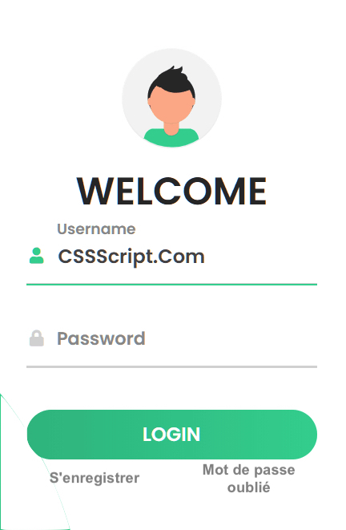

L'exercice consiste à réaliser une page multifonctionnelle. Elle contiendra :

- Une fonction login
- Une fonction d'enregistrement
- Une fonction de récupération de mot de passe

Chaque page s'affichera exclusivement. C'est à dire, si une page s'affiche les
autres disparaissent.

# La page login

## Mobile

Il y aura :

- un logo
- une zone de texte pour le nom d'utilisateur
- une zone de mot de passe
- un bouton se connecter
- et deux liens pour s'enregistrer et pour récupérer le mot de passe

Tous ces éléments s'affichent en colonne.
Attention, les zones de saisies sont précédés par des libellés ou des placeholders.

## Tablette

C'est les mêmes éléments que le mobile mais disposés comme suit :

- Le logo s'affiche au centre de la zone qui prend 50% de la moitié de la page
- L'autre moitié de la page affiche le formulaire comme le mobile

## Desktop

Il s'affiche comme la tablette mais contenu dans une "card" à bord arrondi et
avec une ombre portée assez large.
